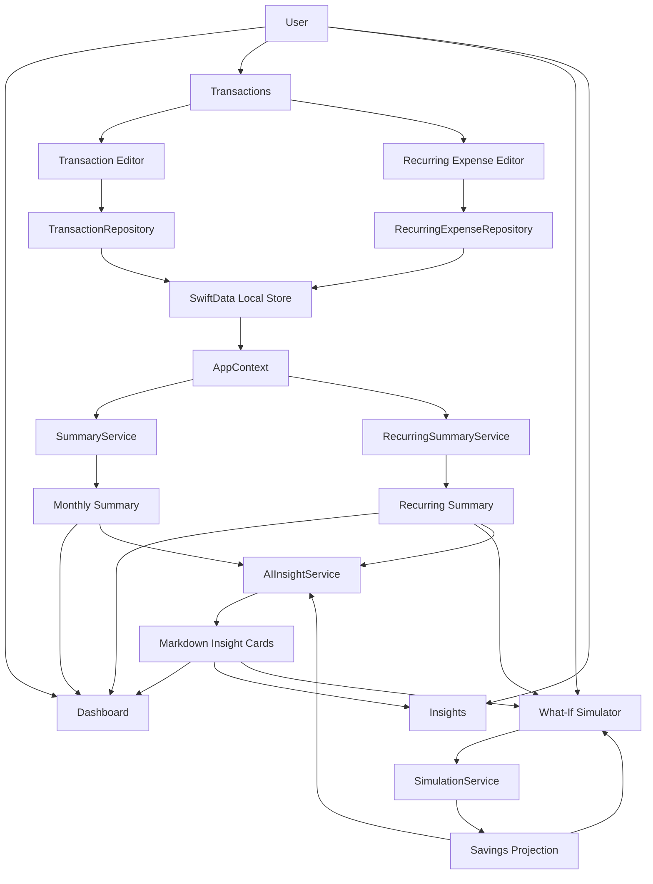

# FinSight AI

FinSight AI is an AI-first personal finance startup concept packaged as a local-first iOS app. The goal is to help people move from passive expense logging to active financial decision-making through clear spending visibility, personalized insights, and scenario-based planning.

## Vision

Most finance apps show users what already happened. FinSight AI is designed to help users understand what it means and what to do next.

The product focuses on three core outcomes:

- expense tracking
- behavioral spending insight
- forward-looking financial simulation

The long-term startup direction is a financial decision assistant that feels more like an intelligent money coach than a ledger.

## Product Thesis

FinSight AI is built around a simple thesis:

- users do not just want records
- users want interpretation
- users want realistic next steps

The app is intended to surface:

- where money is going
- what habits may be risky
- what improvements are realistic
- how small changes compound over time

## Current MVP

The current version is a fully local v1 MVP. It uses SwiftData for persistence and is structured to support Apple Intelligence as the long-term on-device AI layer.

## Features

### Dashboard

- monthly total spending
- category breakdown chart
- recent transaction snapshot
- AI insight card state

### Transactions

- add transactions
- edit transactions
- delete transactions
- grouped monthly history

### Insights

- budgeting insight section
- risk insight section
- growth insight section

### Simulator

- daily savings input
- spending reduction slider
- savings goal slider
- deterministic monthly and long-range projections
- AI explanation state

## Why It Matters

FinSight AI is aimed at a user segment that is underserved by traditional budgeting apps:

- people who want simple financial clarity without spreadsheet-heavy workflows
- users who need motivation through insight, not just raw numbers
- early-career earners and young professionals trying to build savings discipline

This makes the product suitable both as a consumer finance concept and as a startup portfolio case for intelligent financial UX.

## Tech Stack

- SwiftUI
- SwiftData
- Swift Charts
- Xcode project generated via Ruby and `xcodeproj`

## Architecture

The app is organized around protocol-backed services so the UI is not tightly coupled to storage or AI provider details.

Core components:

- `AppContext`: app-wide state and feature orchestration
- `TransactionRepository`: local CRUD and seed handling
- `RecurringExpenseRepository`: user-managed recurring expense storage
- `SummaryService`: monthly aggregation and dashboard summary building
- `RecurringSummaryService`: recurring expense totals and transaction classification
- `SimulationService`: deterministic savings calculations
- `AIInsightService`: AI abstraction for insights and simulator explanations
- `CapabilityService`: checks whether Apple Intelligence support is available



## Apple Intelligence

The codebase includes an abstraction layer for Apple Intelligence through `FoundationModels`.

Important note:

- the real Apple Intelligence path is guarded behind compile-time and runtime checks
- when the required SDK or runtime is unavailable, the app shows a clear unavailable state instead of fake AI output

This keeps the project buildable today while preserving the intended architecture for future Apple Intelligence-enabled environments.

## Startup Direction

The current app is the foundation for a broader startup roadmap. Likely evolution paths include:

- personalized multi-agent financial coaching
- account aggregation and transaction import
- cloud sync and cross-device continuity
- longitudinal spending memory and behavior tracking
- proactive savings nudges and risk alerts
- subscription or premium coaching features

## Getting Started

### Requirements

- macOS
- Xcode 16.3 or newer
- iOS Simulator

### Run In Xcode

1. Open `FinSightAI.xcodeproj`
2. Select the `FinSightAI` scheme
3. Choose an iPhone simulator such as `iPhone 16`
4. Press `Cmd+R`

On first launch, the app seeds sample transaction data so the UI is immediately populated.

### Build From Terminal

```bash
xcodebuild -project FinSightAI.xcodeproj -scheme FinSightAI -destination 'generic/platform=iOS Simulator' build
```

### Run Tests

```bash
xcodebuild -project FinSightAI.xcodeproj -scheme FinSightAI -destination 'platform=iOS Simulator,OS=18.4,name=iPhone 16' test
```

## Project Structure

```text
FinSightAI/
  App/
  Design/
  Features/
    Dashboard/
    Insights/
    Simulator/
    Transactions/
  Models/
  Services/
  Utils/
FinSightAITests/
Tools/
```

## Testing

Automated coverage currently includes:

- transaction validation
- monthly summary aggregation
- simulator projection math
- peso currency formatting
- app-context save flow

Manual smoke checks:

- confirm seeded data appears on first launch
- add, edit, and delete transactions
- verify dashboard totals update after changes
- move simulator sliders and verify projections update instantly
- confirm the insights screen handles AI availability cleanly

## Roadmap

Potential next steps:

- Supabase auth and sync
- CSV import
- richer Apple Intelligence prompt flows
- server-backed AI orchestration
- offline-first sync and reconciliation
- onboarding and retention flows
- premium insight packaging

## Project Generation

The Xcode project is generated with:

- `Tools/generate_project.rb`

To regenerate:

```bash
ruby Tools/generate_project.rb
```

## Status

This repository represents an MVP for a startup-style product direction. It is meant to demonstrate product thinking, architecture, UX direction, and technical feasibility rather than full production readiness.
