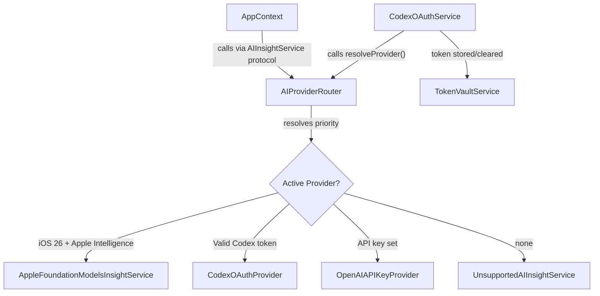

# FinSight AI — Codex OAuth Integration Plan

**Status:** Planning  
**Last updated:** 2026-04-23  
**Repository:** [itsonlyfranz/FinSight-Ai-iOS](https://github.com/itsonlyfranz/FinSight-Ai-iOS)

## Implementation checklist

- [ ] Derive exact OAuth `client_id`, `redirect_uri`, and model name from OpenClaw source before writing auth code
- [ ] Add `finsightai://` URL scheme (manual `Info.plist` or project generator changes)
- [ ] Create `TokenVaultService.swift` — Keychain wrapper for OAuth token CRUD
- [ ] Create `CodexOAuthService.swift` — PKCE flow, `ASWebAuthenticationSession`, token exchange, refresh actor
- [ ] Create `CodexOAuthProvider.swift` and `OpenAIAPIKeyProvider.swift` conforming to `AIInsightService`
- [ ] Create `AIProviderRouter.swift` — `@Observable`, conforms to `AIInsightService`, re-resolves on auth events
- [ ] Update `FinSightAIApp.swift` to use `AIProviderRouter`; add `resetInsightState()` to `AppContext`
- [ ] Create `SettingsView` + `AIProviderSettingsView`; add Settings tab to `RootTabView`
- [ ] Create `AuthChoiceView` for first-launch provider selection
- [ ] Concurrent refresh actor, revocation handling, subscription tier error, `authErrorMessage` in `AppContext`
- [ ] Tests: `CodexOAuthServiceTests`, `TokenVaultServiceTests`, `AIProviderResolutionTests`

---

## Key architectural insight

`FinSightAIApp.swift` currently hard-wires `aiInsightService` at launch. For **immediate provider swap** at runtime, introduce `AIProviderRouter` — a type that conforms to `AIInsightService` and delegates to a live-swappable implementation. `AppContext` keeps the same initializer; pass an `AIProviderRouter` instead of a concrete service.



## Existing files that change

- [`FinSightAI/App/FinSightAIApp.swift`](../FinSightAI/App/FinSightAIApp.swift) — replace static `aiService` switch with `AIProviderRouter()` instantiation
- [`FinSightAI/App/RootTabView.swift`](../FinSightAI/App/RootTabView.swift) — add a Settings tab
- [`FinSightAI/App/AppContext.swift`](../FinSightAI/App/AppContext.swift) — optionally add `func resetInsightState()` so auth events can clear stale results

## New files

```
FinSightAI/
  Services/
    Auth/
      CodexOAuthService.swift      ← PKCE, ASWebAuthenticationSession, token exchange
      TokenVaultService.swift      ← Keychain read/write/delete wrapper
    Providers/
      AIProviderRouter.swift       ← @Observable; conforms to AIInsightService; re-resolves on demand
      CodexOAuthProvider.swift     ← Calls OpenAI Responses API with Bearer token
      OpenAIAPIKeyProvider.swift   ← Calls OpenAI API with stored API key
  Features/
    Settings/
      SettingsView.swift           ← Top-level settings screen (new tab)
      AIProviderSettingsView.swift ← Connect/disconnect ChatGPT, API key input, active indicator
    Onboarding/
      AuthChoiceView.swift         ← First-launch provider selection (shown if no provider configured)
FinSightAITests/
  CodexOAuthServiceTests.swift
  TokenVaultServiceTests.swift
  AIProviderResolutionTests.swift
```

## Pre-work: derive OAuth constants from OpenClaw

Before writing auth code, extract from OpenClaw’s public source the exact values for:

- `client_id` (verify; do not guess)
- `redirect_uri` (registered callback scheme)
- Required scopes

Define these as constants in `CodexOAuthService.swift`:

```swift
private enum OAuthConstants {
    static let clientID     = "<derived from OpenClaw>"
    static let redirectURI  = "finsightai://oauth/callback"
    static let authURL      = "https://auth.openai.com/oauth/authorize"
    static let tokenURL     = "https://auth.openai.com/oauth/token"
    static let scopes       = "openid profile email"
}
```

## Phase 1 — PKCE + Keychain (Week 1–2)

**`TokenVaultService.swift`** — thin `Security` framework wrapper; exposes:

```swift
func store(_ value: String, forKey: String) throws
func retrieve(forKey: String) throws -> String?
func delete(forKey: String) throws
```

**`CodexOAuthService.swift`** — owns the full PKCE flow:

- `startOAuthFlow(presentationAnchor:)` → opens `ASWebAuthenticationSession` with `prefersEphemeralWebBrowserSession = false`
- `handleCallback(url:)` → extracts code + validates state, then calls token exchange
- `refreshTokenIfNeeded()` → checks `expires_at`, refreshes if stale, re-stores via `TokenVaultService`

**URL scheme registration:** The project uses `GENERATE_INFOPLIST_FILE = YES` in `project.pbxproj`, which does not support `CFBundleURLTypes`. Add `finsightai://` by either adding `INFOPLIST_KEY_*` entries via `generate_project.rb`, or switching to a manual `Info.plist` (`GENERATE_INFOPLIST_FILE = NO`). Prefer a manual `Info.plist` for ongoing control.

## Phase 2 — Provider layer (Week 2–3)

**`CodexOAuthProvider.swift`** — conforms to `AIInsightService`:

- Reads bearer token via `TokenVaultService`, with refresh via `CodexOAuthService.refreshTokenIfNeeded()` first
- POSTs to OpenAI Responses API with an `openai-codex/*` model (exact name TBD from OpenClaw)
- 401 → clear token, throw `.unavailable("Session expired. Please reconnect ChatGPT.")`

**`OpenAIAPIKeyProvider.swift`** — conforms to `AIInsightService`:

- Reads API key from `UserDefaults` (acceptable for API keys vs OAuth tokens in Keychain)
- Same Responses API shape with `Authorization: Bearer <api_key>`

**`AIProviderRouter.swift`** — immediate-swap mechanism:

```swift
@Observable final class AIProviderRouter: AIInsightService {
    private(set) var activeProviderLabel: String = "None"
    private var currentProvider: any AIInsightService = UnsupportedAIInsightService(reason: "No provider configured")

    func resolveProvider(capabilityService: CapabilityService) {
        // priority: Apple Intelligence → Codex OAuth → API Key → Unavailable
        // sets currentProvider and activeProviderLabel
    }

    func generateInsights(from summary: MonthlySummary) async throws -> [InsightCard] {
        try await currentProvider.generateInsights(from: summary)
    }
    // explainSimulation delegates similarly
}
```

Update `FinSightAIApp.swift`: replace the `switch capabilityService.aiAvailability` block with router creation, `resolveProvider`, and pass the router into `AppContext`.

## Phase 3 — Auth UI (Week 3–4)

**`SettingsView.swift`** — new tab in `RootTabView`; embed `AIProviderSettingsView`.

**`AIProviderSettingsView.swift`:**

- Active provider indicator (e.g. “ChatGPT · Connected”)
- “Connect with ChatGPT” → `CodexOAuthService.startOAuthFlow()` → on success `router.resolveProvider()` → `appContext.resetInsightState()`
- “Use API Key” — secure field + save
- “Sign out” — clear Keychain, `router.resolveProvider()`

**`AuthChoiceView.swift`** — first-launch sheet gated by `UserDefaults` (`hasChosenProvider`); options for ChatGPT OAuth, API key, Apple Intelligence (if eligible), skip.

## Phase 4 — Error handling (Week 4)

- Concurrent token refresh: Swift `actor` in `CodexOAuthService` to serialize refresh
- Revoked refresh token: clear Keychain, `router.resolveProvider()`, user-facing alert (`authErrorMessage` on `AppContext`)
- Insufficient subscription: map API 403 to a dedicated `AIInsightError` case

## Phase 5 — Tests (Week 4–5)

- `CodexOAuthServiceTests` — verifier length, challenge = BASE64URL(SHA256(verifier)), state validation
- `TokenVaultServiceTests` — round-trip store/retrieve, expiry comparison
- `AIProviderResolutionTests` — mock capability + token + API key combinations

## Dependencies

All Apple SDK — no new Swift packages:

| Framework | Use |
|-----------|-----|
| `AuthenticationServices` | `ASWebAuthenticationSession` |
| `CryptoKit` | SHA-256 for PKCE |
| `Security` | Keychain |
| `URLSession` | Token exchange + API calls |

## Acceptance criteria

- ChatGPT subscriber can sign in via OAuth and receive insights without an API key
- Token stored in Keychain and refreshed automatically before use
- Expired/revoked tokens prompt re-auth without crash or silent failure
- API key path remains a fallback; Apple Intelligence path unchanged
- No OAuth credentials in `UserDefaults`, logs, or crash reports
- Unit tests cover auth helpers and provider resolution
