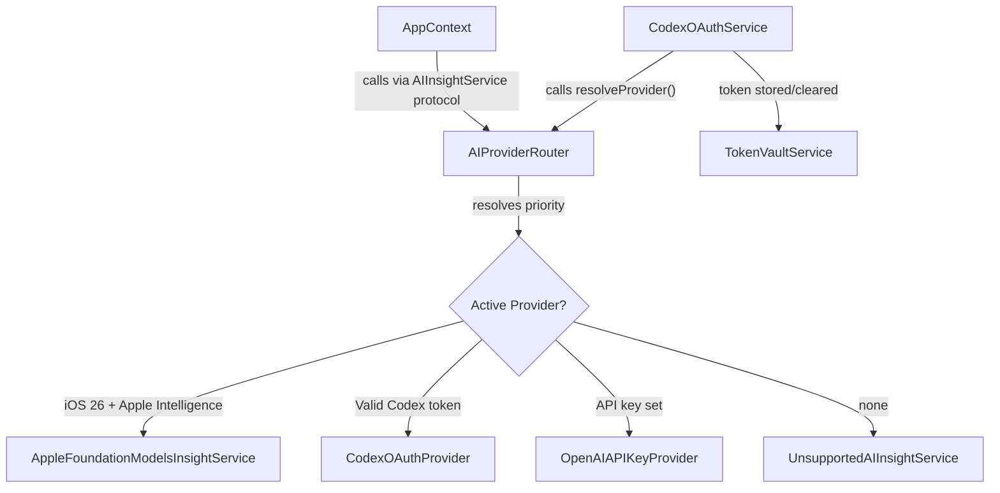

# FinSight AI — Codex OAuth Integration Plan

## Key Architectural Insight

`FinSightAIApp.swift` currently hard-wires `aiInsightService` at launch. Since we need **immediate provider swap** at runtime, we introduce `AIProviderRouter` — a class that conforms to `AIInsightService` and acts as a live-swappable delegate. `AppContext`'s signature stays unchanged; we simply pass it an `AIProviderRouter` instead of a concrete service.



## Existing Files That Change

- [`FinSightAI/App/FinSightAIApp.swift`](FinSightAI/App/FinSightAIApp.swift) — replace static `aiService` switch with `AIProviderRouter()` instantiation
- [`FinSightAI/App/RootTabView.swift`](FinSightAI/App/RootTabView.swift) — add a Settings tab
- [`FinSightAI/App/AppContext.swift`](FinSightAI/App/AppContext.swift) — no protocol changes; optionally add `func resetInsightState()` so auth events can clear stale results

## New Files

```
FinSightAI/
  Services/
    Auth/
      CodexOAuthService.swift      ← PKCE, ASWebAuthenticationSession, token exchange
      TokenVaultService.swift      ← Keychain read/write/delete wrapper
    Providers/
      AIProviderRouter.swift       ← @Observable; conforms to AIInsightService; re-resolves on demand
      CodexOAuthProvider.swift     ← Calls OpenAI Responses API with Bearer token
      OpenAIAPIKeyProvider.swift   ← Calls OpenAI API with stored API key
  Features/
    Settings/
      SettingsView.swift           ← Top-level settings screen (new tab)
      AIProviderSettingsView.swift ← Connect/disconnect ChatGPT, API key input, active indicator
    Onboarding/
      AuthChoiceView.swift         ← First-launch provider selection (shown if no provider configured)
FinSightAITests/
  CodexOAuthServiceTests.swift
  TokenVaultServiceTests.swift
  AIProviderResolutionTests.swift
```

## Pre-work: Derive OAuth Constants from OpenClaw

Before writing any auth code, extract from [OpenClaw's source](https://github.com) the exact values for:
- `client_id` (e.g. `app_EMSc9Ew0YqZOlVnDqIlGn6S` — verify before use)
- `redirect_uri` (registered callback scheme)
- Required scopes

Define these as constants in `CodexOAuthService.swift`:
```swift
private enum OAuthConstants {
    static let clientID     = "<derived from OpenClaw>"
    static let redirectURI  = "finsightai://oauth/callback"
    static let authURL      = "https://auth.openai.com/oauth/authorize"
    static let tokenURL     = "https://auth.openai.com/oauth/token"
    static let scopes       = "openid profile email"
}
```

## Phase 1 — PKCE + Keychain (Week 1–2)

**`TokenVaultService.swift`** — thin `Security` framework wrapper; exposes:
```swift
func store(_ value: String, forKey: String) throws
func retrieve(forKey: String) throws -> String?
func delete(forKey: String) throws
```

**`CodexOAuthService.swift`** — owns the full PKCE flow:
- `startOAuthFlow(presentationAnchor:)` → opens `ASWebAuthenticationSession` with `prefersEphemeralWebBrowserSession = false`
- `handleCallback(url:)` → extracts code + validates state, then calls token exchange
- `refreshTokenIfNeeded()` → checks `expires_at`, refreshes if stale, re-stores via `TokenVaultService`

**URL scheme registration:** The project uses `GENERATE_INFOPLIST_FILE = YES` in `project.pbxproj`, which does not support `CFBundleURLTypes`. Add `finsightai://` by either:
- Adding `INFOPLIST_KEY_*` entries via `generate_project.rb` for URL types, **or**
- Switching to a manual `Info.plist` (set `GENERATE_INFOPLIST_FILE = NO`, add `Info.plist` to sources)

Recommend the manual `Info.plist` approach for easier ongoing control.

## Phase 2 — Provider Layer (Week 2–3)

**`CodexOAuthProvider.swift`** — conforms to `AIInsightService`:
- Calls `TokenVaultService` for the bearer token, triggering refresh via `CodexOAuthService.refreshTokenIfNeeded()` first
- POSTs to OpenAI Responses API with `model: "openai-codex/gpt-4o"` (exact model name TBD from OpenClaw)
- 401 response → clears token, throws `.unavailable("Session expired. Please reconnect ChatGPT.")`

**`OpenAIAPIKeyProvider.swift`** — conforms to `AIInsightService`:
- Reads API key from `UserDefaults` (acceptable for API keys — not a secret in the same threat model as OAuth tokens)
- Same OpenAI Responses API call but with `Authorization: Bearer <api_key>`

**`AIProviderRouter.swift`** — the immediate-swap mechanism:
```swift
@Observable final class AIProviderRouter: AIInsightService {
    private(set) var activeProviderLabel: String = "None"
    private var currentProvider: any AIInsightService = UnsupportedAIInsightService(reason: "No provider configured")

    func resolveProvider(capabilityService: CapabilityService) {
        // priority: Apple Intelligence → Codex OAuth → API Key → Unavailable
        // sets currentProvider and activeProviderLabel
    }

    func generateInsights(from summary: MonthlySummary) async throws -> [InsightCard] {
        try await currentProvider.generateInsights(from: summary)
    }
    // ... explainSimulation delegates similarly
}
```

Update `FinSightAIApp.swift`: replace the `switch capabilityService.aiAvailability` block with:
```swift
let router = AIProviderRouter()
router.resolveProvider(capabilityService: capabilityService)
// pass router as aiInsightService in AppContext init
```

## Phase 3 — Auth UI (Week 3–4)

**`SettingsView.swift`** — new tab in `RootTabView`; contains `AIProviderSettingsView` as a section.

**`AIProviderSettingsView.swift`**:
- Shows active provider chip (e.g. "ChatGPT Pro · Connected")
- "Connect with ChatGPT" button → calls `CodexOAuthService.startOAuthFlow()` → on success calls `router.resolveProvider()` → `appContext.resetInsightState()`
- "Use API Key" row → secure text field, save button
- "Sign out" (when connected) → clears Keychain, calls `router.resolveProvider()`

**`AuthChoiceView.swift`** — shown as a `.sheet` on first launch (gated by a `hasChosenProvider` flag in `UserDefaults`). Three options + skip.

Add Settings tab to `RootTabView`:
```swift
SettingsView()
    .tabItem { Label("Settings", systemImage: "gearshape") }
```

## Phase 4 — Error Handling (Week 4)

- Concurrent token refresh: use a Swift `actor` in `CodexOAuthService` to serialize refresh requests (prevents double-refresh race)
- Revoked refresh token: clear all Keychain entries, call `router.resolveProvider()`, show a `.alert` via `AppContext` (add `authErrorMessage: String?` published property)
- Insufficient subscription tier: detect from API 403 response body, surface as a specific `AIInsightError` case

## Phase 5 — Tests (Week 4–5)

- `CodexOAuthServiceTests` — verifier length, challenge = BASE64URL(SHA256(verifier)), state CSRF check
- `TokenVaultServiceTests` — round-trip store/retrieve, expiry comparison
- `AIProviderResolutionTests` — mock all three capability states, assert correct provider type selected
- Extend existing `FinSightAITests.swift` pattern (already uses `@MainActor` test style)

## Dependencies

All Apple SDK — no new packages required:
- `AuthenticationServices` — `ASWebAuthenticationSession`
- `CryptoKit` — SHA-256 for PKCE
- `Security` — Keychain
- `URLSession` — token exchange + API calls

## Acceptance Criteria

- ChatGPT subscriber can sign in via OAuth and get insights without an API key
- Token stored in Keychain, refreshed transparently before each API call
- Switching providers mid-session updates the active provider immediately (no restart)
- Apple Intelligence, API key, and "unavailable" paths all remain functional
- No credentials in UserDefaults, logs, or crash reports
- All auth and resolution logic has unit test coverage
